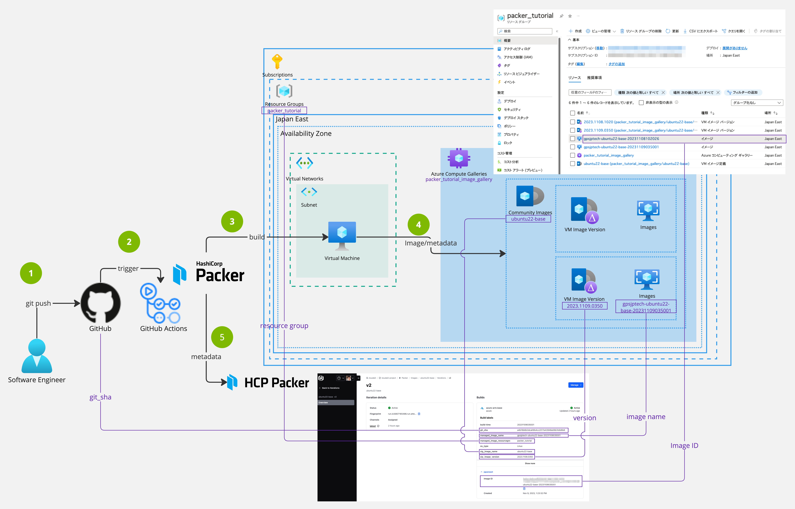

# packer_tutorial



## Manual run in local

in MacOS

## Install Packer

```console
$ brew tap hashicorp/tap
$ brew install hashicorp/tap/packer
```

## Test

```console
$ packer init
$ packer validate .
$ packer fmt
$ packer build docker-ubuntu.pkr.hcl
```

## Set up HCP Packer

sign up HCP Pakcer and get service principals

ref https://portal.cloud.hashicorp.com/access/service-principals

```console
# Set up service principals for hcp-packer
export HCP_CLIENT_ID=
export HCP_CLIENT_SECRET=
```

## Set up Azure

- Azure account
- `az` and `az login`
- Subscription Contributor role
- you can get <subscription_id> below. `az account show --query "{ subscription_id: id }" -o json | jq -r .subscription_id`

```console
$ cd hcp-packer-ubuntu22-base
$ script/setup-hcp-packer
```

## Build

```console
$ cd hcp-packer-ubuntu22-base
$ packer validate .
$ packer fmt .
$ packer build .
```
